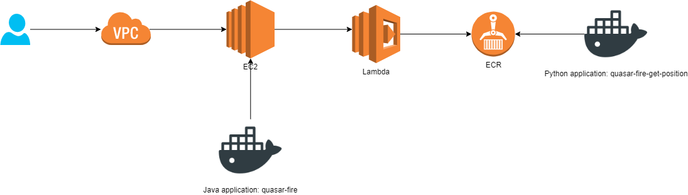
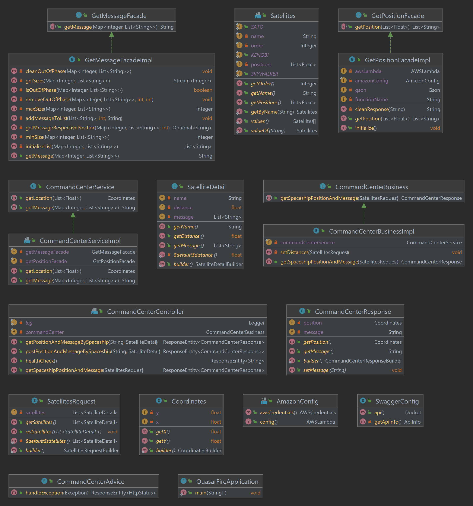

# Operación fuego de Quasar #

Han Solo ha sido recientemente nombrado General de la Alianza
Rebelde y busca dar un gran golpe contra el Imperio Galáctico para
reavivar la llama de la resistencia.

El servicio de inteligencia rebelde ha detectado un llamado de auxilio de
una nave portacarga imperial a la deriva en un campo de asteroides. El
manifiesto de la nave es ultra clasificado, pero se rumorea que
transporta raciones y armamento para una legión entera.

### Desafío ###

Programa que retorne la fuente y contenido del mensaje de auxilio . Para esto, cuentas con tres satélites que te permitirán triangular la posición, ¡pero cuidado! el mensaje puede no llegar completo a cada satélite debido al campo de asteroides frente a la nave.

### Posición de los satélites actualmente en servicio ###

* Kenobi: [-500, -200]
* Skywalker: [100, -100]
* Sato: [500, 100]

### API documentation ###
**Swagger:**
ec2-3-83-81-39.compute-1.amazonaws.com:9091/swagger-ui.html#/command-center-controller

### Postman collection ###
Usar environment: **aws**

https://www.postman.com/warped-crater-712565/workspace/quasar-fire/collection/10368539-93955b07-6435-4bbd-a332-989bdfc12b66?action=share&creator=10368539

### Host ###
ec2-3-83-81-39.compute-1.amazonaws.com:9091

### Proceso de despliegue ###

Ejecutar script **deploy.sh** en ec2

### Diagrama de componentes AWS ###

### Diagrama UML ###
